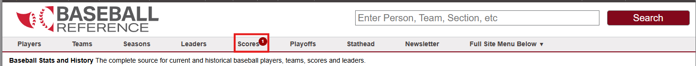
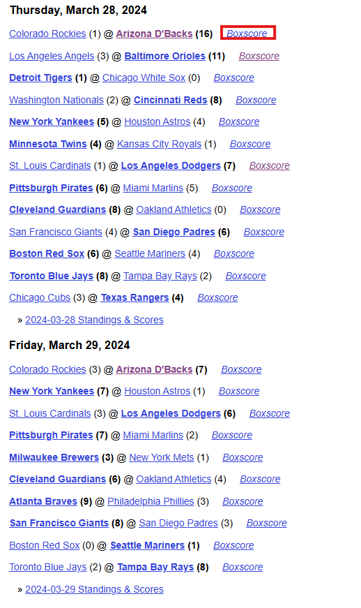
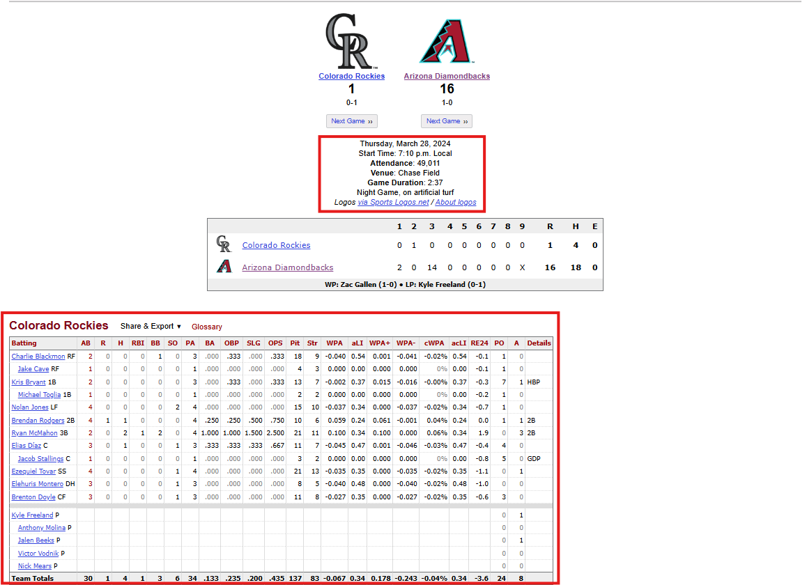
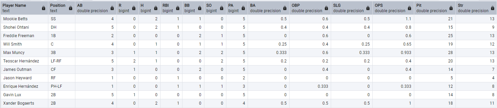
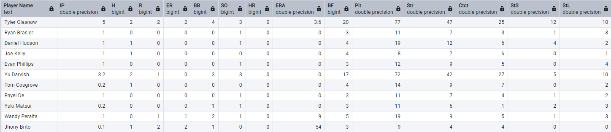

# **Baseball Web Scraping**

Baseball is often referred to as America’s pastime, with a rich history, abundant statistics, and loyal fanbase it is also considered a data-rich sport. However, this information is stored in webpages like [Baseball Reference](https://www.baseball-reference.com). The main focus of this project is to web scrape baseball reference to gather this data and store in an AWS RDS database to be used for future statistical analysis.

*Side-note:*  Although there are python libraries such as [baseball-scraper](https://pypi.org/project/baseball-scraper/), I took this project as a personal challenge to refresh web scraping abilities and put them in practice with a topic that I am passionate about.

## Project Development

### Exploring Baseball Reference

First we need to identify the data that we are interested in. If we visit the baseball reference page, we can find a header that reads "Scores".

In here we can find a list of all the matches that took place in a specific season. For this project we are going to be focusing on the recent 2024 season. Searching in this page we can find a link that reads "boxscore" for every one of the matches.

After clicking in this link we are redirected to a page that contains the information of that game. This information includes 4 tables that contain the batting and pitching stats of each of the two teams. Also it includes the metadata of that day that depicts the time, attendance of the match, etc. All this information is going to be captured and uploaded to the database.

### Capturing the Information

When developing the code that will extract the information from the page HTML first I developed a "Test Enviroment" so that I can explore the page and see if the code will gather the information and store it as wished. First, the file [Match_Scraping_Test_Env.ipynb](TEST_ENV/Match_Scrapping_Test_Env.ipynb) is where I tested the code so that It would gather the information from a specific match. After having the code and structure it as a function, I then proceeded to create file [Baseball_Season_Scrap_Test_Env.ipynb](TEST_ENV/Baseball_Season_Scrap_Test_Env.ipynb) where I explored the season page and stablished how the code should loop around all the matches and gather the data.

*Important Findings:* It was during this stage of the project that I was able to refresh my knowledge regarding HTML files and selenium to webscrape the data. At first I used the "Requests" library to gather the HTML from the webpage, however we needed to wait for the page to fully load. For this I changed to selenium to wait until the page is fully loaded before getting the HTML. Also a benefit of selenium at this stage is that it gives the option to see the web browser work in real time. This gave me a useful troubleshooting tool to identify where the code was getting stuck, if it was accessing the right page, etc.

### Cleaning and Storing the Data

After making sure that the code was able to go to all the matches in a season and gather the information, it was time to fully run the code on "Prod Enviroment" in the file [Match_Season_Scrap.ipynb](PROD_ENV/Match_Season_Scrap.ipynb). In here the WebDriver had the argument "headless" that uses the webdriver in the background and save some resources when performing the scrapping. Also, after the code gathered the data from a page, a sleep timer of 5 seconds was added to avoid any HTTP errors and port exhaustion. The code takes some time to extract all the information, but after that I stored it on a csv to later be used in the file [DB_Connection.ipynb](PROD_ENV/DB_Connection.ipynb) to upload it to the AWS database.

Before storing the data in the database, we needed to clean the data first. First of all, If we look at the raw data receintly stored, we are going to find that there are some things that need to be cleaned up if we are going to be using this database for future analysis. The first thing that stands out, is that both the name and position of the player are stored on under the same column. The same behaviour happens on the pitching, but instead of the player's position, it had some notes like the win-lose record. For the batting data, the decision was to create two columns, one for the player's name and other for the position. In regards to the pitching data, since not all the registries had these notes and they did not represented the same information in all cases, the decision was to only store the name of the player in an independent column. Both of these actions were acomplished thanks to regular expresions that isolated each part of the string and stored it in the corresponding new column.

Secondly, the venue name was stored as "Venue: Dodger Stadium" so to make it easier to read, I extracted only the venue's name and rewrote the column. Then, came the turn of the "Attendance" column. It was important for future analysis to transform it from a string format to an integer format. First of all, I needed to remove "Attendance: " from each of the registries. After that I performed the transformation but I noticed something strange. There were registries that had the name of the venue instead of the the actual attendance of the match. Further troubleshooting, I found that this behaviour was due because not all games had an attendance registry. Because of this, in these registries' the venue was on the attendance column and the venue column contained a different information.

To solve this issue, first I had to copy the venue name on to the correct column. After this was done and all the other registries were transformed to integers, I still needed to correct this registries. Since they represented a significant ammount of registries, the decision to eliminate them was off the table. Replacing them with a 0 still did not felt right because in the end, the game was played infront of people, we just did not had the registry. The final decision was to replace it with the average attendance for that specific venue. This way allowed me to keep the registries and still have them represent a story closer to reality.

**Working with AWS RDS:** For the database, I used an amazon RDS built with the free-tier template. The RDS has a PostgreSQL engine so access is also possible using PgAdmin. After creating the RDS, a VPC was created to add specific rules so that the only connection allowed to the database resource was from my own public IP. After uploading the clean data in the document [Data_Engineering.ipynb](PROD_ENV/Data_Engineering.ipynb), we validated the information and this is the output of the table using PgAdmin

**Batting Table**

**Pitching Table**

### Learnings
With the conclusion of this project, one of the most important learnings was to refresh my knowledge in HTML file structure. This knowledge can be used in the future to create dashboards or web-pages showcasing insights, etc. Secondly, regarding the web-scrapping side of the project, I learned how to automize the process of the data collection, clean it and store it, creating a simple and manual ETL process. Lastly, the SQL and Cloud knowledge of creating a data base instance that will help me in using the cloud as a tool to improve future project.
